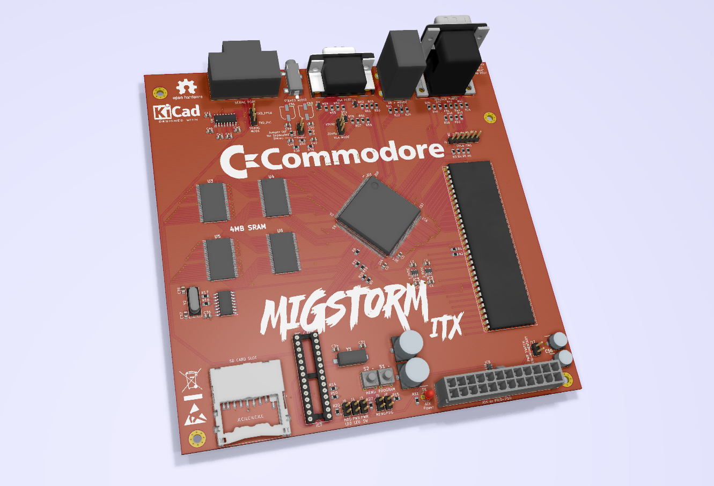

# MigStorm-ITX
A 68000 socketed ITX form factor Minimig.

## Info
Tested by Zenon to boot with Pistorm and CaffeineOS, also with a regular M68k CPU. It appears to be fully working, and I've received feedback from at least 10 people that it is working well in their testing. It could use more general trace cleanup/enhancement, but works as-is.

## Mouser Cart
https://www.mouser.com/ProjectManager/ProjectDetail.aspx?AccessID=da74540bb5 \
At the time of making the Mouser cart, all parts were in stock. If parts go out of stock, EOL, have a part number change, or have a minimum order quantity change -- seach for equivalent replacements or they may be able to be sourced from Arrow and Digikey. I recommend using Octopart and other similar sites to search for parts if you can't find something. I caution using sources like Ebay and Aliexpress for key components, especially from China-based sellers with little to no feedback since they'll often sell counterfeit items. Sometimes you get lucky, sometimes you don't. Primary/authorized retailers are highly recommended for component purchases so you do less troubleshooting and spent more time playing. \
\
As a DIY project, total cost for all parts and a board should come out to just under $150. (plus the cost of a CPU/Pistorm, power supply, and case) \
\
An interactive HTML BOM has been added to the main repository to assist with building.

## Other Stuff
jjsaenz1969's 3D printed case for Migstorm: https://www.thingiverse.com/thing:7063501

## Rev History
v0.6 -- Current rev to build. Updated PS/2 Mouse & Keyboard to use redundant clock & data lines due to issues with some keyboards and mice using splitter style pinout. \
v0.5 -- Updated silkscreen for capacitor polarity upon community request. Updated iBOM and BOM. \
v0.4 -- Corrected PS/2 Mouse & Keyboard pwr/gnd pinout. \
v0.3 -- Changed soft-power circuit from 555 timer to a MAX16054, cleaned up a few traces with lots of vias. Still need more cleanup. [depreciated rev, do not build] \
v0.2 -- Initial rev with corrected 68k socket size. [depreciated rev, do not build] \
v0.1 -- Alpha release, incorrect 68k footprint width. [depreciated, removed]
